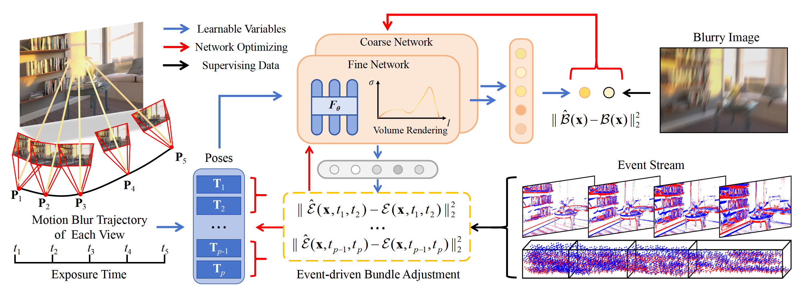

# Code for Deblurring Neural Radiance Fields with Event-driven Bundle Adjustment (ACM MM 2024)
This is an official PyTorch implementation of the EBAD-NeRF. Click [here](https://icvteam.github.io/EBAD-NeRF.html) to see the video and supplementary materials in our project website.

## Method Overview



## Code

### Synthetic Data

The configs of the synthetic data are in the config_blender.txt file. Please download the synthetic data below and put it into the corresponding file (./data/blender_llff/). Then you can use the command below to train the model.

```
python train_blender.py --config config_blender.txt
```

### Real-World Data

The configs of the real-world data are in the config_davis.txt file. Please download the real-world data below and put it into the corresponding file (./data/davis_llff/). Then you can use the command below to train the model.

```
python train_davis.py --config config_davis.txt
```

## Datasets

### Synthetic Data

The synthetic data can be downloaded at [here](https://drive.google.com/drive/folders/112SGk_v-fxaUKz7w9dOqhXZRnkwTMkIt?usp=sharing). We use five Blender scenes from BAD-NeRF to construct this dataset. To increase the difficulty of the data, we add non-uniform camera shake. As shown in the folder, each scene folder contains five parts: 

"images": images for training.

"images_gt_blur": ground truth images of blur view for testing.

"images_gt_novel": ground truth images of novel view for testing.

"events.pt": the event data for training.

"pose_bounds.npy": the initial poses for training.

### Real-World Data

The real-world data can be downloaded at [here](https://drive.google.com/drive/folders/1BNxZtD5PcZBEzKu7i08FFLzJFDCEodY9?usp=drive_link). We use Davis 346 event camera to capture the real-world data. The data consist of two scenes as shown in the folder. Each folder contains four parts:

"images": images for training.

"images_gt_novel": ground truth images of novel view for testing.

"events.pt": the event data for training.

"pose_bounds.npy": the initial poses for training.

Notice that we set b=6 for real-world data because the blur degree is larger than the synthetic data. Additionally, for real-world data experiement in the paper, we select four novel view images (No.[3, 10, 17, 24]) in the "images_gt_novel" folder for testing.


## Citation

If you find this useful, please consider citing our paper:

```bibtex
@inproceedings{qi2024deblurring,
  title={Deblurring neural radiance fields with event-driven bundle adjustment},
  author={Qi, Yunshan and Zhu, Lin and Zhao, Yifan and Bao, Nan and Li, Jia},
  booktitle={Proceedings of the 32nd ACM International Conference on Multimedia},
  pages={9262--9270},
  year={2024}
}
```

## Acknowledgment

The overall framework and camera trajectory metrics computing are derived from [BAD-NeRF]([https://github.com/yenchenlin/nerf-pytorch/](https://github.com/WU-CVGL/BAD-NeRF)).  We appreciate the effort of the contributors to these repositories. Additionally the event loss is derived from our previous work [E<sup>2</sup>NeRF](https://github.com/iCVTEAM/E2NeRF).

